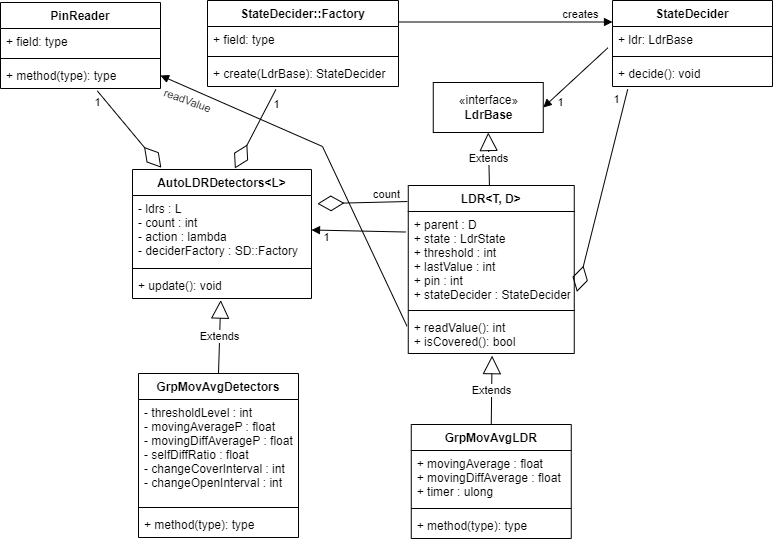

# Design Overview
The implementation is divided in a class that handles the detector with the chosen 
detection algorithm, and a class that reflects the state of each connected LDR.
The detector class consists of a base class that manages the set of connected LDRs and
one child class for each detector algorithm.
The LDR class also consists of a base class that holds information about the LDR and
one child class for each detector algorithm that holds data needed for that algorithm.
There is also a StateDecider class that decides when an LDR shall change state.
The StateDecider class is a base class and a number of child classes implement different
decider algorithms.

A class diagram is shown below where the base classes are shown at the top and child
classes for one of the detector algorithms below.



## AutoLdrSpotDetectors class

The AutoLdrSpotDetectors class is a base class for the detector algorithms. 
It is a template class that has the LDR class type as template parameter.

It holds the following fields:
* ```ldrs``` : an array of pointers to LDR objects.
* ```count``` : the count of LDR objects
* ```action``` : a reference to a SensorChangeAction object that has a method that will
  be called when an LDR is deemed to have changed state to covered or open.
  The main program provides an object of this type to perform the desired action.  

The AutoLdrSpotDetectors class defines these key methods:
* a constructor : sets up the detector and creates the set of LDR objects of the 
  type given by the LDR template parameter type.
* ```setup()``` : initializes the LDR objects by calling ```setup()``` on them.
  This is called from the global ```setup()``` function in the Arduino sketch.
* ```update()``` : a virtual method that shall be called regularly by the controlling
  main program. 
  It shall be overridden by child classes to provide an implementation for the respective
  detector algorithm.
* ```onChange(...)``` : called when a LDR is deemed to have changed state. Forwards the call
  to the SensorChangeAction object
  
## LDR class

Each LDR is connected to an analog pin and the Arduino reads
a value (0-1023) which is low for bright light and high for darkness.
Each LDR also maintains a state (covered / not covered) that has been determined by 
the chosen detector algorithm.

The LDR class represents the LDR state. The LDR class is a base class and the child 
classes hold information about the LDR for the specific detector algorithm.
It is also a template class with one template parameter for the concrete LDR class
and a second template parameter for the concrete detector algorithm class.

It has the following fields:
* ```parent``` : a pointer to the detector object that owns this LDR object                             |
* ```sensorPin``` : pin number that the LDR is connected to                                                |
* ```lastValue``` : the last value read from the LDR sensor pin                                            |
* ```state``` : one of OPEN, COVERED, COVERING, OPENING                                                |
* ```threshold``` : a value the lastValue is compared against and updated by the chosen detector algorithm |

The LDR class defines these key methods:
* ```create(...)``` : sets key fields when the LDR object is created by the detector class.
* ```setup()``` : this finishes the setup of the LDR object and is called by the detector object
  while called from the global ```setup()``` function in the Arduino sketch.
  ```setup()``` is virtual so that child classes can do their own setting up.
* ```readValue()``` : reads the LDR value from the connected pin. This is virtual so that 
  child classes can do any specific processing.

## Algorithm classes
The child classes of AutoLdrSpotDetectors and LDR are described in the pages that describe 
the different detector algorithms: 
* [Simple Threshold](ThresholdDesign.md) implements a simple threshold.
  The LDR is considered covered when the read value exceeds a set threshold value.
  This algorithm is used for testing the hardware and as a reference
  implementation to show what can be achieved with LDR detectors.
* [Adjusting Threshold](AdjustingThresholdDesign.md) adjusts the threshold
  for slow changes to ambient light.
  This algorithm is based on Julian Coles' LDR detectors.
* [Moving Average](MovingAverageDesign.md) implements a self adjusting
  algorithm where a threshold is set based on an average value read from
  each LDR.
* [Group Moving Average](GroupMovingAverageDesign.md) is a variation
  where a moving average is kept of the recent difference between the last value
  and the moving average value.
  The LDR is adjusted with this average diff from all LDRs. The own
  LDR diff is weighted higher.

## StateDecider class
The concrete state decider implements the algorithms for deciding when an LDR
shall change state.
There is one StateDecider object for each LDR.
The StateDecider object is created during the setup phase by a factory object
owned by the specific detector algorithm.

There are a few state decider algorithms:
* InstantStateDecider : Changes state of the LDR as soon as the read value 
  passes the threshold of the LDR.
* TimedStateDecider : Changes state of the LDR when the read value has stayed
  above/below the threshold for a given time period.
* IntegrationStateDecider : Keeps a counter that is incremented by the difference
  between the LDR value and threshold. 
  When this counter reaches a limit the LDR state is changed.

A state decider factory can be provided when a detector algorithm is created.
If no such factory is provided the detector algorithm uses a default factory 
that is chosen to suit that detector algorithm.